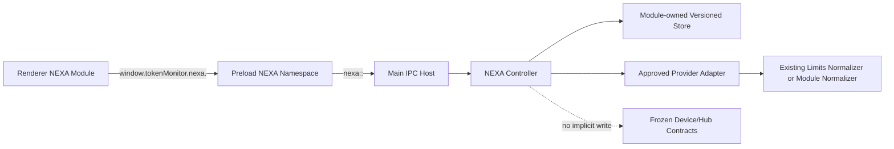

# NEXA Core Extension Contract 001

项目 ID：`NEXA-CORE-EXT-CONTRACT-001`  
契约版本：`1.0`  
状态：架构设计基线，尚未实施  
目标工程：`E:\AI工作台\个人控制台\01_desktop-hub\token-monitor`  
日期：2026-08-05

> 本文定义未来NEXA模块接入Core时必须遵守的扩展规范。文中的`nexa` Controller、IPC namespace、Renderer注册器及新Schema均为设计契约，不代表当前源码已经实现，也不授权在本任务中修改源码或协议。

## 0. 依据、范围与规范用语

设计依据：

- `NEXA_CORE_ENGINEERING_AUDIT_001.md`；
- `NEXA_CORE_BASELINE_001B_REPORT.md`；
- `NEXA_CORE_COMPAT_001_REPORT.md`；
- 当前token-monitor源码中的Runtime、Preload、Renderer UMD模块、Limits Adapter和`node:test`模式。

本文使用：

- **MUST / 必须**：违反即不允许接入Core；
- **MUST NOT / 禁止**：兼容或安全红线；
- **SHOULD / 应当**：默认方案，偏离时必须记录理由和风险；
- **MAY / 可以**：兼容边界内的可选实现。

当前冻结基线不得被本契约覆盖：`window.tokenMonitor`、84个invoke/handle、7个send/on、14个推送事件、Device Record、Hub HTTP/SSE、settings/credentials、数据路径及产品发布身份继续以`NEXA_CORE_COMPAT_001_REPORT.md`为准。

### 0.1 设计原则

1. 扩展优先，替换禁止；新增独立边界，不改义旧边界。
2. Main拥有能力和权限，Preload拥有最小桥接，Renderer只负责交互与展示。
3. 新模块默认本地、可选、可关闭、可回滚，不因启动失败阻断旧Core。
4. 数据先版本化再落盘；读旧数据必须确定，遇未知未来版本必须失败关闭。
5. Provider只输出归一化结果，不向Renderer或Hub传递凭据、原始响应或绝对本机路径。
6. 不引入新框架、构建器、状态库、数据库或测试栈；沿用CommonJS、原生DOM、UMD和`node:test`。
7. 每次接入只允许一个最小模块，先契约测试，后功能实现。

### 0.2 目标拓扑



虚线表示本契约v1默认禁止把NEXA模块数据写入现有Device Record或Hub；跨设备同步必须另立协议任务。

## 1. Controller规范

### 1.1 位置与职责

未来模块的Controller应位于独立文件，不把业务逻辑直接写入`src/electron/main.js`。建议命名：

```text
src/electron/nexa/<moduleId>Controller.js     # 需要Electron能力
src/shared/nexa/<moduleId>Runtime.js          # 可跨Electron/Agent复用的纯Node逻辑
```

以上路径是未来实现建议，当前不存在。Controller负责：生命周期、输入校验、权限调用、状态快照、错误归一化和资源释放。Main只负责创建Controller、注册固定IPC和在应用退出时停止Controller。

现有依据：`createDeviceRuntime()`组合Usage/Limits并统一停止，`createLimitsRuntime()`暴露生命周期与快照，Expense Runtime拥有`start/reconfigure/stop/getSnapshot`。见`src/shared/deviceRuntime.js:9-99`、`src/shared/limitsRuntime.js:710-787`、`src/electron/expenseRuntime.js:163-244`。

### 1.2 最小接口

每个Controller MUST由工厂创建，并至少提供：

```js
createNexaModuleController(options, deps) => {
  start(): Promise<void> | void,
  stop(): Promise<void> | void,
  getSnapshot(): NexaModuleSnapshot,
  execute(action, input, context): Promise<NexaResult>
}
```

可选能力：

```js
reconfigure(nextOptions): Promise<NexaModuleSnapshot> | NexaModuleSnapshot
subscribe(listener): () => void
getDiagnostics(): SerializableDiagnostics
```

约束：

- `options`只含已校验配置和模块身份；`deps`只含显式注入的文件、时钟、网络、日志、凭据访问器等能力。
- Controller MUST NOT在模块加载时启动定时器、读取文件、访问网络或注册全局事件。
- `getSnapshot()`必须返回克隆后、可structured-clone/JSON序列化的数据，不返回可变内部引用、函数、Error实例、Buffer或Electron对象。
- `execute()`只接受静态允许的action；禁止把Renderer输入直接当方法名、文件路径、URL、命令或IPC channel。
- 一个Controller只拥有一个`moduleId`，不得修改其他模块状态。

### 1.3 生命周期状态机

标准状态：

```text
created -> starting -> running -> stopping -> stopped
                    \-> faulted -> stopping -> stopped
```

规则：

1. `start()`和`stop()`必须幂等；重复调用不创建重复watcher、timer、listener或请求。
2. `stop()`必须取消timer、watcher、AbortController、重试队列和订阅者；停止后迟到结果不得发布。
3. 每次start/reconfigure应使用epoch或generation标识，只有当前epoch可以提交状态；复用`DeviceRuntime`的active/epoch思想。
4. 启动失败只把模块置为`faulted`并产生安全错误快照，不得阻断Electron主窗口或现有Collector/Hub。
5. 应用`before-quit`必须先停止NEXA Controller，再允许进程退出；不得依赖GC释放资源。
6. `reconfigure()`若无法原子应用，必须保留上一份有效配置和快照。

### 1.4 输入、输出与错误

标准快照：

```json
{
  "contractVersion": 1,
  "moduleId": "example",
  "revision": 12,
  "updatedAt": "2026-08-05T12:00:00.000Z",
  "status": "ready",
  "capabilities": ["read"],
  "data": {}
}
```

允许的`status`：`idle | starting | ready | degraded | disabled | error | stopped`。可选字段：`lastAttemptAt`、`stale`、`warnings`；禁止在快照中放stack、请求头、Cookie、Token、API Key、绝对用户路径或原始Provider body。

标准结果：

```json
{ "ok": true, "data": {}, "meta": { "contractVersion": 1 } }
```

或：

```json
{
  "ok": false,
  "error": {
    "code": "notConfigured",
    "message": "Safe user-facing text",
    "retryable": false
  },
  "meta": { "contractVersion": 1 }
}
```

新NEXA接口内部必须统一使用结果包，不改变旧IPC现有的boolean/snapshot/`{ok}`混合返回。`error.code`必须稳定；`message`用于显示但不作为程序分支依据。

### 1.5 权限边界

Controller权限采用默认拒绝：

| 能力 | 默认 | 获准条件 |
|---|---|---|
| 读取模块配置 | 允许 | 只通过Main提供的安全配置视图 |
| 读取凭据 | 禁止 | 通过主进程固定credential accessor；只给具体Provider所需最小值 |
| 文件读写 | 禁止 | 仅模块自有目录、固定文件名、路径解析后仍在根内、原子写 |
| 网络 | 禁止 | Adapter声明固定HTTPS origin/path、超时和AbortSignal；不接受Renderer任意URL |
| 子进程/命令 | 禁止 | 必须单独安全审计、固定可执行文件和参数模板 |
| shell/clipboard/dialog | 禁止 | 只能由Main静态action代理并进行allowlist校验 |
| Device Record/Hub写入 | 禁止 | 另立兼容协议任务后才可授权 |

日志必须结构化到最少信息，禁止打印输入payload、凭据、响应body和本机绝对路径。可记录`moduleId/action/errorCode/durationMs/retryCount`。

## 2. IPC扩展规范

### 2.1 Namespace

未来Preload扩展只能位于：

```js
window.tokenMonitor.nexa.<moduleId>.*
```

禁止新增第二个全局对象，禁止把NEXA方法放到`window.tokenMonitor`根级，禁止修改现有方法。当前Preload全局和调用方式依据：`src/electron/preload.js:5-191`。

Main channel命名：

```text
nexa:<moduleId>:getSnapshot
nexa:<moduleId>:<verb>
nexa:<moduleId>:changed
```

`moduleId`和`verb`必须为静态小写ASCII kebab-case，编译/加载时由固定描述符声明；不得由Renderer动态拼接channel。

### 2.2 方法形状

每个模块的最低Preload表面：

```js
window.tokenMonitor.nexa.<moduleId> = {
  getSnapshot: () => ipcRenderer.invoke('nexa:<moduleId>:getSnapshot'),
  execute: (request) => ipcRenderer.invoke('nexa:<moduleId>:execute', request),
  onChanged: (callback) => { /* returns unsubscribe */ }
};
```

业务稳定后可把`execute`拆成静态命名方法，但每个方法仍必须只接收一个对象参数。v1禁止可变位置参数，以便后续增加可选字段。

请求包：

```json
{
  "contractVersion": 1,
  "requestId": "renderer-generated-opaque-id",
  "action": "refresh",
  "input": {}
}
```

规则：

- `contractVersion`必需且当前只接受1；未知版本返回`unsupportedContractVersion`。
- Main在调用Controller前校验对象深度、字符串长度、数组长度和枚举；拒绝`__proto__`/constructor等危险key。
- 单个请求应设置大小上限；建议默认64 KiB，导入类功能单独审批，不能沿用无限payload。
- Preload回调只传payload，不暴露Electron event对象；`onChanged`必须返回unsubscribe，与现有14个订阅事件模式一致。
- 推送payload为完整快照或`{revision,changedKeys}`，不得只发无法恢复的隐式增量；Renderer检测revision缺口时重新`getSnapshot()`。
- IPC handler不得抛出包含内部路径/stack的错误给Renderer；统一为NexaResult。

### 2.3 注册与冲突控制

未来允许的注册描述符：

```js
{
  moduleId: 'example',
  contractVersion: 1,
  invokeChannels: ['nexa:example:getSnapshot', 'nexa:example:execute'],
  pushChannels: ['nexa:example:changed']
}
```

该描述符是设计格式，尚未实现。注册器未来必须：

1. 在启动时检查重复moduleId/channel并失败关闭该模块；
2. 禁止覆盖84+7+14冻结channel；
3. 持有注册清理句柄，模块停止时移除NEXA handler/listener；
4. 只注册静态allowlist，不扫描目录自动加载代码；
5. 暴露只读诊断，不暴露Controller对象给Renderer。

### 2.4 兼容演进

- 同一channel的既有字段只能保持或新增可选字段，不能改名、删除、改变单位或把nullable改为必需。
- 破坏性变更必须新增channel版本，如`nexa:<module>:v2:<action>`，旧版在至少一个明确迁移周期内保留。
- 新Preload方法必须在旧Main不可用时允许UI降级；Renderer用capability检测而不是假设存在。
- 每次新增NEXA channel必须证明冻结的84/7/14集合未变化。

## 3. Renderer扩展规范

### 3.1 技术与权限

Renderer继续使用原生HTML/CSS/JavaScript和当前UMD/CommonJS双暴露模式，不引入React/Vue、路由库、bundler或全局状态库。现有模块例子：`expenseView.js`将API同时暴露为`module.exports`和`window.TokenMonitorExpenseView`，且文件系统只通过Preload桥访问；见`src/electron/renderer/expenseView.js:5-13,318-322`。

Renderer MUST NOT：

- 直接读取文件、环境变量、凭据或Node模块；
- 直接fetch Provider或Hub以绕过Main策略；
- 修改现有全局`state`的无关字段；
- 注册未清理的window/document listener、timer或observer；
- 接收并渲染未转义HTML、凭据、stack或原始响应。

### 3.2 模块接口

每个页面模块应是闭包内自持状态的UMD模块，建议接口：

```js
{
  moduleId: 'example',
  mount(root, context): void,
  activate(params): Promise<void> | void,
  render(snapshot): void,
  deactivate(): void,
  destroy(): void
}
```

`context`只允许：模块自己的Preload API、翻译函数、安全格式化器、导航回调和只读主题信息。不得把整个`window.tokenMonitor`或主应用可变`state`传入模块。

生命周期：

- `mount`每个DOM root只执行一次；
- `activate`可重复，负责订阅与首次快照；
- `deactivate`暂停刷新并取消订阅，但可保留轻量UI状态；
- `destroy`释放所有listener/timer/observer并清空对DOM的引用；
- 迟到Promise必须用activation epoch丢弃。

### 3.3 页面接入与注册

未来页面描述符：

```js
{
  id: 'nexa-example',
  moduleId: 'example',
  labelKey: 'views.nexaExample',
  orderHint: 900,
  capability: 'example.read',
  create: () => window.NexaExampleView
}
```

这是未来静态注册格式，当前不存在。实施时：

1. 由一个小型静态allowlist注册，不扫描目录、不下载插件、不执行配置中的代码。
2. Host只管理`id/label/order/capability/active`和生命周期调用；业务状态留在模块闭包。
3. 新页面id使用`nexa-`前缀，不改现有view id与顺序语义。
4. HTML只增加模块root和script引用；`app.js`只做薄接线，不搬移旧页面代码。
5. 页面不可用或Controller faulted时显示模块级降级态，Home、Settings和旧视图仍可用。

现状没有通用页面注册器；现有view集合和state集中在`renderer/app.js:232-314`，脚本顺序静态定义于`renderer/index.html:1367-1407`。因此首个实现任务只能新增最小host，不得借机重构整个Renderer。

### 3.4 状态隔离

每个模块的Renderer state至少分为：

```text
serverSnapshot   # Main返回的只读快照
viewState        # 展开、排序、筛选等纯UI状态
requestState     # busy/requestId/errorCode
lifecycleState   # mounted/active/epoch/unsubscribe
```

规则：

- `serverSnapshot`整体替换，不由UI原地修改；
- optimistic update只允许局部展示，并在失败时回滚；
- 不把敏感输入写入state、localStorage、DOM dataset或日志；
- 模块状态不得成为Device Record、settings或其他模块的隐式真源；
- 跨模块协作通过Main Controller的明确action或只读事件，不直接互改对象。

### 3.5 样式与可访问性

- 所有选择器以`[data-nexa-module="<moduleId>"]`或`.nexa-<moduleId>-`作用域开头；禁止覆盖全局元素选择器和旧class。
- 复用现有CSS变量、间距和字体，不新增Design System任务。
- 新页面必须支持键盘访问、可见焦点、语义按钮/label、状态`aria-live`及reduce-motion设置。
- 文案只通过现有i18n机制和新namespaced key，如`nexa.example.*`；不得硬编码单语言文本。

## 4. 数据扩展规范

### 4.1 v1边界

本契约v1禁止修改现有Device Record、Usage Period、Session、Project、History、Hub API和SSE。NEXA模块数据默认只存在于模块自有本地Store，并通过`window.tokenMonitor.nexa.*`按需读取。

如果未来确需跨设备同步，必须另立`NEXA Core Protocol Extension`任务，包含mixed-version矩阵、payload预算、安全脱敏和Node/Worker双实现验证；不能在普通模块任务中顺带增加Device字段。

### 4.2 模块Store Schema

建议路径概念：

```text
<Electron userData>/nexa/<moduleId>/state.json
```

实际路径必须由Main基于`app.getPath('userData')`生成，不接受Renderer路径；当前不得创建。根文档：

```json
{
  "schemaVersion": 1,
  "moduleId": "example",
  "revision": 1,
  "createdAt": "2026-08-05T12:00:00.000Z",
  "updatedAt": "2026-08-05T12:00:00.000Z",
  "data": {},
  "extensions": {}
}
```

字段规则：

- `schemaVersion/moduleId/revision/data`必需；时间为ISO 8601 UTC字符串。
- `extensions`只允许模块自有namespaced可选字段；未知可选字段在读写往返时应保留，除非安全策略要求剥离。
- 不允许在Store中保存原始凭据；只保存credential reference/配置状态或稳定hash标识。
- 不保存绝对workspace路径到任何可能同步的结构；本地确需路径时放入明确`localOnly`子文档并禁止导出。
- 数值必须明确单位，字段名带单位后缀，如`durationMs/bytes/costUsd`。

### 4.3 版本与迁移

1. 读取`schemaVersion:1`必须先normalize，再交给Controller。
2. 缺失版本的旧草案数据不得猜测；除非该模块定义了显式v0迁移fixture。
3. 读取高于当前支持版本时返回`unsupportedSchemaVersion`，不覆盖、不清空、不降级写回。
4. `vN -> vN+1`迁移必须是纯函数，可重复执行并有fixture；先写临时文件、验证、原子rename，再替换。
5. 迁移失败保留原文件并停止该模块写入；不能影响Core其他模块。
6. 破坏性字段变更只能提升`schemaVersion`；同版本只允许新增有安全默认值的可选字段。
7. 删除字段前至少保留一个读取迁移周期，并记录降级/回滚影响。

复用依据：现有`credentials.json`、daily/session archive均使用version和原子写；未知Credential version会报错。见`src/shared/credentialStore.js:7-36,96-169`、`src/shared/dailyHistoryArchive.js:9-68,206-217`、`src/shared/sessionUsageArchive.js:69-106,275-286`。

### 4.4 Snapshot Schema与可选字段

IPC Snapshot与持久Store分离：Snapshot只发显示所需字段。新增可选字段必须满足：

- 缺失时旧行为成立；
- `null`、空集合、零值语义明确且不混用；
- 旧Renderer可忽略，新Renderer能处理旧Main缺失；
- 不改变既有字段单位或枚举含义；
- 有字段存在/缺失两套测试；
- 有最大长度/数量限制，避免无界IPC与落盘增长。

禁止使用`any payload`、任意JSON path或未经定义的`metadata`作为长期契约逃生口。

### 4.5 未来Wire扩展的保留提案

若后续协议任务批准，可评估一个单一可选容器，而不是不断污染Device根：

```json
{
  "extensions": {
    "nexa": {
      "contractVersion": 1,
      "modules": {
        "example": { "schemaVersion": 1, "updatedAt": "...", "data": {} }
      }
    }
  }
}
```

该结构仅为未来评审输入，**不属于当前Device Record，也不授权实现**。批准前必须证明：旧Hub保留或安全忽略、旧Renderer不崩溃、同步payload预算有上限、public Worker脱敏完整、Node/Worker一致。

## 5. Provider Adapter规范

### 5.1 选择正确扩展点

- 只提供额度/余额/重置窗口的AI服务，必须接入现有Limits Adapter与Normalizer，不另建NEXA Provider体系。
- 提供NEXA专属能力且不属于Limits wire的服务，可在模块内部实现独立Adapter，但必须复用本节的检测、错误、安全和测试规则。
- 同一凭据不得被多个模块各自保存；统一通过Credential Store固定映射或后续经审计的模块credential namespace。

现有Limits分发与统一归一化依据：`src/shared/limitCollector.js:3388-3498`、`src/shared/limits.js:350-420`。

### 5.2 Adapter接口

推荐接口：

```js
{
  id: 'provider-id',
  capabilities: ['limits.read'],
  detect(context): Promise<DetectionResult>,
  collect(context): Promise<NormalizedResult>,
  validate?(context): Promise<ValidationResult>,
  dispose?(): void
}
```

`context`只含：已净化配置、最小凭据、注入fetch/clock/logger、AbortSignal、deadline和scope。Adapter禁止自行读取Renderer state、任意用户目录或全局配置。

### 5.3 能力检测

检测结果：

```json
{
  "configured": true,
  "available": true,
  "capabilities": ["limits.read"],
  "source": "api",
  "sourceDetail": "managed"
}
```

规则：

- `configured`表示存在足够配置，不代表凭据有效；
- `available`只能在安全探测后确认，不能因配置存在就宣称服务可用；
- 检测不得产生计费请求、写操作、登录、验证码或账号设置变更；
- 无配置返回`notConfigured`，显式关闭返回`disabled`；不得用`error`代替正常缺省状态。

Limits现有合法状态：`ok,disabled,notConfigured,unauthorized,rateLimited,sourceRateLimited,unavailable,error`；source：`oauth,cli,web,rpc,local,api`。新Limits Provider必须使用这些枚举。依据：`src/shared/limits.js:5-12,29-48`。

### 5.4 输出归一化

Limits Provider必须输出`normalizeLimitProvider()`可接受的结构：provider身份、稳定hash accountKey、安全展示身份、status/source/updatedAt、windows、可选balance/resetCredits/region。Window使用`kind=session|weekly|billing`，`metric=credits|spend`仅在语义匹配时设置；币种和百分比不得猜测。依据：`src/shared/limits.js:147-172,350-403`。

新增Provider ID需要同步评审：

- `LIMIT_PROVIDER_IDS`与`VALID_PROVIDERS`；
- Renderer标签、图标、显示顺序与设置；
- `.env.example`和所有README支持表；
- Node/Worker共享normalizer；
- Guard tests。

这是一组原子变更，不允许只在Collector注册后宣称完成。现有列表依据：`src/shared/limitCollector.js:58,95-108`、`src/shared/limits.js:6`。

### 5.5 超时、并发、重试与保留

- 每个请求必须接收AbortSignal并有有限deadline；禁止永久pending。
- 遵守Provider物理上限和全局并发；同Provider按latest-wins串行lane，不能并发覆盖新结果。
- 429/Retry-After进入有界backoff并增加jitter；禁止紧循环。
- transient失败保留lastGood，同时记录lastAttempt；未经成功确认不能用空窗口覆盖有效旧值。
- stop/reconfigure必须取消请求和重试；迟到结果按epoch丢弃。
- Provider错误转换为稳定status/errorCode；不向上抛原始响应、header、URL query或凭据。

复用依据：`src/shared/limitsRuntime.js:700-787`、`src/shared/limitCollector.js:3413-3482`。

### 5.6 安全边界

- 只允许固定HTTPS origin；本地Provider例外必须固定loopback/Unix socket且做SSRF边界评审。
- Renderer不得提供任意baseUrl，除非该Adapter本身是已审计的自定义Provider，并对协议、host、path、认证方式、JSON path和大小做严格限制。
- 日志和错误不得包含Cookie、Authorization、API Key、响应body或账号隐私。
- accountKey必须稳定hash；公开Worker输出继续剥离账户身份和敏感balance明细。
- 真实Provider调用只在明确的集成测试环境中运行，默认单元测试必须注入fake fetch。

## 6. 测试规范

### 6.1 最低测试矩阵

每个新模块在合并前必须至少包含：

| 层 | 必测内容 |
|---|---|
| Controller单元 | start/stop幂等、stop释放资源、迟到结果丢弃、reconfigure回滚、snapshot克隆、错误归一化 |
| IPC契约 | channel静态唯一、参数校验、未知action/version拒绝、结果包、push unsubscribe、无Electron event泄露 |
| Renderer模块 | mount/activate/deactivate/destroy、空/加载/错误/ready、重复激活、无未清理listener、危险文本不走innerHTML |
| 数据Schema | v1 round-trip、缺失可选字段、null/0/空集合、未知未来版本拒绝、迁移幂等、原子写失败保留旧文件 |
| Provider Adapter | 未配置、未授权、429、超时、网络错误、畸形/超大响应、Abort、lastGood保留、无真实网络 |
| 兼容守卫 | 原84 invoke、7 send、14 push不变；Device/Hub fixture不变；package/appId/productName/updater不变 |

### 6.2 测试技术

- 使用现有`node:test`与`node:assert/strict`；不引入Jest、Vitest、Playwright或新覆盖率工具。
- Shared/Controller通过依赖注入测试，不启动Electron。
- Renderer优先测试纯函数/UMD模块；必要DOM测试使用项目已有轻量stub/VM模式。
- IPC wiring可使用源码结构断言，但关键参数和返回必须另有行为测试，不能只靠正则。
- Provider测试必须注入fake fetch、fake clock、fake timer和AbortSignal。

现有测试入口：`package.json:14,24-25`；参考：`tests/shared/deviceRuntime.test.js`、`tests/shared/limitsRuntime.test.js`、`tests/shared/deviceWireCompatibility.test.js`、`tests/shared/syncPayload.test.js`、`tests/electron/deviceRuntimeWiring.test.js`、`tests/electron/*Presentation.test.js`、`tests/hub/server.test.js`。

### 6.3 必过门禁

普通NEXA模块任务最低要求：

```text
npm run lint
node --test <模块直接相关测试>
node --test <IPC/兼容守卫测试>
```

`npm test`只有在隔离凭据、禁用真实Provider网络并确认不会写用户数据时才能作为全量门禁；当前仓库存在live Grok integration边界，不能未经审查直接运行。任何未运行项目必须记录原因和验收影响。

### 6.4 负向安全测试

至少覆盖：超长字符串/数组、原型污染key、路径穿越、任意URL、未知action、未知schema、重复requestId、stop后返回、凭据出现在snapshot/error/log、模块失败影响旧Core。安全失败必须fail closed且不改用户数据。

## 7. 可扩展区域与禁止区域

### 7.1 可扩展

- 新的独立Controller/Runtime文件；
- 新的`window.tokenMonitor.nexa.<moduleId>`子命名空间；
- 新的`nexa:<moduleId>:*`静态channel；
- 新的UMD Renderer页面模块和作用域CSS；
- 新的模块自有versioned store；
- 按现有normalizer接入的新Limits Provider；
- 新的单元、结构、fixture与兼容守卫测试。

每项扩展仍需单任务精确白名单；本文不是批量修改授权。

### 7.2 禁止修改

- 现有84+7+14 IPC、`window.tokenMonitor`根方法及返回语义；
- Device Record、Usage/History/Session/Project、Hub路径和SSE；
- settings/credentials现有字段、路径、version和安全暴露规则；
- `TOKEN_MONITOR_*`及已文档化环境变量的既有语义；
- appId、productName、package name、Updater repo、artifact名和签名链；
- `main.js`/`renderer/app.js`的大规模拆分、框架迁移或状态重构；
- StarBench、额度新UI、Design System或其他非当前模块功能；
- 真实账号登录、付费API、签名、发布或用户数据迁移。

## 8. 单模块接入流程

每个未来模块必须按以下顺序：

1. 提交模块契约：moduleId、能力、Controller接口、IPC、Snapshot/Store Schema、权限、错误码、测试矩阵。
2. 运行兼容检查：证明旧IPC、Device、Hub、配置、路径、发布身份不变。
3. 实现纯Controller和Schema测试，不接UI。
4. 实现Main静态注册与Preload `nexa`子命名空间，完成IPC行为/安全测试。
5. 实现隔离Renderer模块和最小静态注册，完成生命周期/DOM测试。
6. 如有Provider，最后接Adapter并以fake网络验证全部失败路径。
7. Codex审查diff、测试、权限和回滚，生成独立验收报告。
8. 一个模块完成后停止；不得顺带开始第二模块或重构旧Core。

## 9. 模块契约模板

未来任务输入至少填写：

```text
【项目路径】
【模块ID】
【目标】
【输入】
【Controller接口】
【IPC channels与方法签名】
【Snapshot Schema】
【Store Schema与schemaVersion】
【Provider能力与固定端点】
【权限清单】
【允许修改范围】
【禁止事项】
【执行方式】
【测试要求】
【兼容验收标准】
【回滚方式】
【停止条件】
【最大模型调用次数】
```

缺少权限、Schema、兼容或停止条件时不得进入代码阶段。

## 10. 验收清单

实现任务只有全部回答“是”才可通过：

- [ ] 模块通过独立Controller接入，Main只有薄接线；
- [ ] 使用`window.tokenMonitor.nexa.<moduleId>`，没有污染旧API；
- [ ] 所有channel为静态`nexa:<moduleId>:*`且不与冻结清单冲突；
- [ ] Controller生命周期幂等、可停止，迟到结果不会提交；
- [ ] Renderer状态、DOM、CSS、listener完全隔离；
- [ ] Store有schemaVersion、原子写、未知版本保护和迁移测试；
- [ ] Device Record和Hub协议未变化，或已由独立协议任务批准；
- [ ] Provider使用能力检测、有限超时、Abort、稳定状态和归一化输出；
- [ ] Renderer/Hub/日志中不存在凭据、原始响应或绝对隐私路径；
- [ ] 未新增技术栈、依赖或锁文件变化；
- [ ] 原84+7+14 IPC、数据、配置和发布身份守卫通过；
- [ ] Lint与最低相关测试通过；未运行测试有明确安全原因；
- [ ] 修改范围可单独回滚，没有夹带重构或新功能。

## 11. 第一阶段实施建议

本文完成后不立即创建NEXA功能模块。建议下一任务只做一个“契约守卫测试设计/实现”任务：固定现有IPC集合、Device/Hub fixture和发布身份，并为尚未实现的NEXA接口保留失败测试或文档fixture。随后选择一个无网络、无凭据、无Device/Hub同步的最小只读模块验证Controller→Preload namespace→Renderer模块链路。

第一阶段明确不做：StarBench、UI框架迁移、Main/Renderer拆分、产品改名、数据目录迁移、Updater换仓库或跨设备NEXA Schema。

## 12. 最终结论

NEXA接入Core的首选边界是：**独立、可停止的Controller；`window.tokenMonitor.nexa.*`最小Preload桥；静态、隔离的Renderer模块；模块自有versioned store；复用现有Limits Adapter与Normalizer；以兼容守卫保护旧Core。**

该方案复用token-monitor已有架构，不要求新技术栈，也不要求先重构`main.js`或`renderer/app.js`。任何需要改变Device Record、Hub、配置、产品身份或更新链路的需求都不属于普通模块扩展，必须升级为独立兼容迁移任务。
