# NEXA Registered Target Execution V1

## 1. 结论

ExecutionHub 第一版外部目标执行应采用：

> **ExecutionHub 内部 Worker + 已注册目标项目 + 内部受控快照 + 白名单原子提升**

Worker 始终属于 ExecutionHub。外部目录不是 Worker，也不能由调用方动态提供；它只能作为静态审核后的 `REGISTERED_TARGET_PROJECT_V1`。OpenCode 在内部 Worker 的本次 run stage 中工作，不直接获得外部目标目录写权限。测试通过后，由持有正式项目锁的可信 Runner 仅把注册记录允许的文件原子提升到目标项目。

第一版固定约束：一个注册目标（鹊桥）、一个内部 Worker、一个 write 任务、最大并发 1、无自动重试、无任意 shell、无 HTTP execute、无鹊桥自动调用。

## 2. 现有阻断根因与可复用资产

| 现状 | 可复用 | 缺口 |
|---|---|---|
| Worker Manifest | 绑定内部 Worker、配置、数据库、日志与锁 | 没有目标项目注册概念 |
| Task contract/preflight | Schema、绝对路径、项目内路径、冲突和写模式校验 | `project_path`仍来自任务，未绑定静态注册记录；未解析reparse point |
| Project write lock | 原子`wx`、五字段所有权、owner-only release、陈旧锁不自动删除 | 锁键是`project_id`安全化值；需先保证其与注册路径一一绑定 |
| Permit v0.2 | 绑定project/task/run/worker/path/限制/锁并做SHA-256完整性 | 未绑定目标注册版本、注册哈希、仓库身份或策略哈希 |
| Permit消费/handoff | 原子消费、Manifest Worker绑定、完整性与路径复核 | 混合了Worker路径和目标项目路径的语义 |
| Secure launcher | 隐藏输入、子进程密钥注入、内存清理、日志分离 | 单独使用不能提供目标白名单或Permit授权 |
| Secure Runner | mock通用Worker；真实final-gate已验证 | 通用真实execute未开放；真实入口固定smoke Worker |
| 回执 | exit code、timeout、模型/会话、结果哈希、锁释放 | 缺少注册记录、快照、diff和提升证据 |

当前阻断不是“缺少另一个启动器”，而是缺少一个位于现有安全链中的**目标注册与受控提升边界**。

## 3. 推荐术语与责任边界

- **Worker**：ExecutionHub 内部受管执行单元，拥有独立DB、XDG、session、logs和run state。
- **Registered Target Project**：经人工审核、静态写入ExecutionHub受保护配置的外部目标项目。
- **Target Stage**：当前run内部、由目标项目生成的受控快照；OpenCode唯一工作目录。
- **Promotion**：可信Runner在持有项目写锁时，把已验证的白名单diff原子应用到目标项目。
- **Target Registration Hash**：注册记录的内容完整性哈希，不是身份认证凭据。

责任矩阵：

| 组件 | 责任 | 禁止 |
|---|---|---|
| 调用方/Codex | 选择已注册`target_id`、提出任务子集 | 传入或覆盖真实项目路径、Worker路径、命令或日志路径 |
| Registry loader | 读取静态注册、规范化路径、核对身份和状态 | 动态注册、自动修复注册 |
| Preflight | 验证任务是注册策略子集、探测锁 | 持正式锁、接受未注册路径 |
| Permit issuer | 固化注册版本/哈希、Worker、run、路径策略和锁快照 | 从调用方接受覆盖字段 |
| Worker/OpenCode | 只在stage内修改授权文件 | 直接写目标项目、运行shell、改变注册策略 |
| Runner/promoter | 执行固定测试命令、验收diff、原子提升、生成回执 | 扩大文件集、修复模型输出、跳过锁或身份复核 |

## 4. 正确调用与路径模型

```mermaid
flowchart LR
  A["Validated task: target_id only"] --> B["Registry + preflight"]
  B --> C["Project write lock"]
  C --> D["Permit bound to registration hash"]
  D --> E["Internal Worker run state"]
  E --> F["Target stage snapshot"]
  F --> G["OpenCode + DeepSeek in stage"]
  G --> H["Fixed test command registry"]
  H --> I["Diff and hash validation"]
  I --> J["Atomic allowlist promotion"]
  J --> K["Receipt + lock release"]
```



三类路径必须分开：

1. `worker_root`：ExecutionHub内部固定Worker目录；
2. `run_root/stage_root`：Worker本次run的状态和目标快照；
3. `canonical_project_path`：外部已注册目标，只由registry loader产生。

调用方不得提交以上任何运行时路径；任务只提交`target_id`和策略内的相对路径子集。

## 5. REGISTERED_TARGET_PROJECT_V1草案

建议保存：

```text
ExecutionHub/config/registered-target-projects/<target_id>.json
```

并由独立严格Schema验证。不能放进Worker Manifest，因为Worker身份和目标授权是两个不同维度。

```json
{
  "schema_version": "1.0",
  "target_id": "target-queqiao",
  "project_id": "NEXA-QUEQIAO",
  "canonical_project_path": "<PROJECT_ROOT>\\04_automation\\Queqiao",
  "status": "active",
  "revision": 1,
  "execution_strategy": "staged_copy_promote",
  "allowed_worker_ids": ["worker-target-01"],
  "allowed_read_paths": [
    "package.json",
    "package-lock.json",
    "tests/server/local-service.test.mjs",
    "src/server/local-service.mjs",
    "src/server/config.mjs",
    "src/api/router.mjs",
    "src/core/orchestrator.mjs",
    "src/core/file-store.mjs",
    "src/core/state-machine.mjs",
    "reports/NEXA_BRIDGE_ENV_DIAG_001.md"
  ],
  "allowed_write_paths": [
    "tests/server/local-service.test.mjs",
    "reports/NEXA_QUEQIAO_TEST_001_R1.md"
  ],
  "allowed_test_commands": [
    "queqiao-ajv-smoke",
    "queqiao-fixed-port-test",
    "queqiao-unfinished-result-repeat-10",
    "queqiao-full-regression-repeat-3"
  ],
  "risk_level": "medium",
  "repository_identity": {
    "type": "filesystem",
    "volume_serial": "<captured-at-registration>",
    "root_file_id": "<captured-at-registration>",
    "anchor_hashes": [
      {"path": "package.json", "sha256": "<sha256>"},
      {"path": "package-lock.json", "sha256": "<sha256>"}
    ],
    "registration_snapshot_hash": "<sha256>"
  },
  "path_policy": {
    "allow_reparse_points": false,
    "allow_create_files": false,
    "allow_delete_files": false,
    "allow_rename_files": false
  },
  "limits": {
    "max_concurrency": 1,
    "max_model_calls": 1,
    "max_timeout_seconds": 900,
    "automatic_retry": false
  },
  "registered_at": "<RFC3339>",
  "registration_hash": {
    "algorithm": "SHA-256",
    "domain": "NEXA-REGISTERED-TARGET-PROJECT-V1",
    "value": "<64-lowercase-hex>"
  }
}
```

所有关键对象必须`additionalProperties:false`。路径采用目标根相对、`/`分隔的规范形式；禁止绝对子路径、`..`、空路径、通配根和设备路径。`allowed_test_commands`只存命令ID，具体可执行程序、参数数组、超时和重复次数来自ExecutionHub受保护的固定命令目录，调用方不能追加参数。

注册记录哈希计算应排除`registration_hash.value`自身，使用确定性JSON和域分隔。SHA-256只证明内容是否变化，不证明写入者身份；注册目录仍需受操作系统ACL和变更审查保护。

## 6. 项目注册与防路径替换

注册是离线、人工审核的管理动作，不是任务API：

1. 对候选路径执行绝对规范化；
2. 打开目录句柄并获取Windows final path、volume serial、root file ID；
3. 拒绝根目录或任一父/子边界中的junction、symlink、mount point等reparse point；
4. 采集anchor hash和注册快照摘要；
5. 写入受保护注册文件并计算registration hash；
6. 每次preflight、Permit签发、消费、启动和提升前重新核对`status/revision/hash/path identity`。

任务里的`project_id/project_path`不得成为权威值。V1应优先只接受`target_id`；为兼容现有task schema，可暂时要求任务值与registry派生值完全一致，但任何不一致都拒绝，不能以任务值覆盖registry。

路径归属必须使用规范化后的`relative(root,candidate)`和真实文件身份判断，不能使用字符串前缀。相似前缀如`Queqiao-evil`必须拒绝。

## 7. 三种执行方案比较

| 维度 | A. 直接在外部项目执行 | B. 复制到Worker stage后提升 | C. Git worktree执行 |
|---|---|---|---|
| 安全性 | 最低；模型进程直接面对目标树，现有同用户进程缺少OS级写隔离 | 最高；模型只写内部stage，外部写入由可信promoter完成 | 高；隔离工作区，但仍需限制仓库外路径和Git操作 |
| Token消耗 | 低 | 低至中；用增量任务包/文件清单避免模型重复读全树 | 低 |
| 磁盘/时间 | 最低 | 最高；需快照、测试、diff和提升 | 中；Git共享对象，创建快 |
| 回滚 | 弱，需额外备份 | 强；保留preimage和promotion manifest | 强；提交/工作树天然可比较 |
| 文件冲突 | 直接冲突风险最高 | 提升前比较preimage hash，可阻断外部变化 | Git冲突可见，但需合并策略 |
| 实现复杂度 | 表面低，做可靠OS沙箱后很高 | 中；复制和promoter必须严谨 | 中至高；要求Git身份和worktree生命周期 |
| 现有安全链修改 | Runner cwd/权限/回执均需扩展 | Registry、stage、Permit/handoff、promoter扩展；不改密钥链 | 同B外加Git管理、提交和清理策略 |
| 对鹊桥适用性 | 不推荐 | **可用** | 当前不可用：鹊桥根目录没有`.git` |

### 第一版明确推荐

选择B：`staged_copy_promote`。

不选择A，因为OpenCode与Runner使用相同本机用户令牌时，仅靠`permission.edit`不能等价于操作系统强制写白名单；一次工具缺陷就可能写到项目其他文件。

不选择C，因为只读检查确认鹊桥当前没有`.git`，无法建立Git worktree。未来项目具备受验证Git仓库身份后，可以把C作为V2策略，但不能静默从B切换。

## 8. Snapshot、执行与提升

V1完整流程：

1. 获取并持续持有`project_id`正式写锁；
2. 重新验证target registry和路径身份；
3. 只读复制注册允许读取的文件及运行测试必需依赖到`run_root/target-stage`；
4. 复制时拒绝所有reparse point，不跟随链接；记录每个源文件的路径、大小、mtime、file ID和SHA-256；
5. OpenCode以stage为cwd，使用stage相对路径生成`permission.edit`：默认deny、精确allowed allow、forbidden deny、external_directory deny、shell deny；
6. Runner而非模型按命令ID执行固定测试；
7. 比较stage与snapshot，任何未授权diff、删除、重命名或新增立即失败；
8. 提升前再次核对目标文件preimage hash/file ID，防止锁外人工修改或TOCTOU；
9. 对每个精确白名单文件在同目录创建临时文件、fsync/close后原子替换；V1不允许删除或移动；
10. 验证目标postimage hash，写回执，最后按五字段所有权释放项目锁。

对于`node_modules`，V1不应复制到目标写集。可把已注册依赖树作为只读stage依赖来源，或使用受审查的目录复制策略；不得跟随其中可能存在的链接越过注册根。若不能安全运行测试，应阻断而不是改用目标目录直接执行。

## 9. Permit绑定方案

建议升级Permit版本并新增不可覆盖对象：

```json
{
  "target_registration": {
    "target_id": "target-queqiao",
    "revision": 1,
    "registration_hash": "<sha256>",
    "canonical_project_path": "<registry-derived>",
    "repository_identity_hash": "<sha256>",
    "policy_hash": "<sha256>",
    "snapshot_plan_hash": "<sha256>"
  }
}
```

这些字段与`project_id/task_id/run_id/worker_id/owner_pid`、现有路径、timeout、max_model_calls和lock一起进入Permit确定性SHA-256。注册revision/hash变化、status不再active或身份核对失败时，签发、消费和启动均拒绝。不得自动迁移旧Permit。

## 10. Handoff路径模型

handoff新增两个严格对象：

- `worker_binding`：`worker_id`、内部`worker_path`、config/db/XDG/run/log路径，全部来自Worker Manifest；
- `target_binding`：`target_id`、registration hash、外部canonical path、内部stage path、snapshot hash、promotion policy hash，全部来自Permit与registry。

`cwd`固定为内部`stage_path`，不是外部项目目录。外部`canonical_project_path`只交给可信snapshot/promoter代码，绝不作为OpenCode可覆盖参数。日志、DB、XDG、session、claim、receipt仍全部位于内部Worker的`run_root`。

## 11. 写入白名单与路径安全

至少实施以下独立检查：

- 词法规范化：拒绝`..`、绝对子路径、UNC/device path、ADS、空段和非法字符；
- 真实路径：对现有文件和最近存在父目录使用句柄获取final path；
- reparse point：注册根、源路径、stage和提升父目录全部拒绝junction/symlink/mount point；
- 路径归属：用`relative`和volume/file identity，不用`StartsWith`；
- 相似前缀：显式负向测试`Queqiao-evil`；
- 精确文件集：V1不开放目录级任意写；
- TOCTOU：snapshot和promotion之间持锁，并在替换前复核preimage file ID/hash；
- 差异审查：stage全部变化必须等于Permit内精确白名单；
- OS边界：OpenCode没有外部目标写句柄；只有promoter持有短生命周期目标写能力。

## 12. 项目锁与并发

复用现有原子项目写锁和五字段所有权，不重新设计锁文件算法。现有锁键由`project_id`规范slug加SHA-256摘要生成；因此registry必须强制：

- 一个active`project_id`只能映射一个canonical project identity；
- 一个canonical identity不能被多个active`project_id`注册；
- 锁从snapshot前持有到promotion验证、回执落盘前；
- 仅同一`project_id/task_id/run_id/worker_id/owner_pid`可释放；
- 陈旧锁只阻断，不自动删除。

V1全局只允许一个目标、一个Worker、一个write任务。readonly也不得与该目标write任务共享可变stage。

## 13. 密钥、DB与XDG隔离

继续复用已验收的安全启动器：

- `Read-Host -AsSecureString`一次；
- `DEEPSEEK_API_KEY`只进入OpenCode子进程环境；
- 不进入注册、任务、Permit、handoff、参数、日志、回执或永久环境；
- 启动后清除明文和BSTR，退出后释放进程对象。

以下目录始终保留在ExecutionHub内部Worker的`run_root`，绝不放到外部目标：

- `OPENCODE_DB`
- `XDG_CONFIG_HOME`
- `XDG_DATA_HOME`
- `XDG_STATE_HOME`
- `XDG_CACHE_HOME`
- TEMP/TMP、session、stdout、stderr、summary和receipt

## 14. 测试命令边界

V1不接受命令字符串。注册记录只列命令ID；ExecutionHub内部固定命令目录把ID解析为：

- 固定可执行程序的规范绝对路径；
- 固定参数数组；
- 固定cwd=`stage_root`；
- 固定超时、重复次数、允许退出码；
- `shell=false`；
- 禁止调用方或模型追加参数。

鹊桥首个任务所需的4个命令应分别覆盖AJV smoke、固定端口单测、unfinished重复10次和完整回归3轮。生产47831健康检查是Runner只读验收步骤，不允许测试关闭该PID。

## 15. 回执与审计证据

现有receipt扩展记录：

- target id、revision、registration hash和repository identity hash；
- snapshot manifest/hash；
- stage diff manifest/hash；
- 每个提升文件的target preimage/stage/postimage SHA-256与file ID；
- 固定测试命令ID、每轮退出码、时间、stdout/stderr路径；
- 模型、会话、数据库路径、run_id；
- OpenCode退出码、timeout、permission拒绝事件；
- promotion状态与回滚材料路径；
- 写锁获取、持有和释放证据；
- `execution_success`、`validation_success`、`telemetry_complete`分离。

所有证据位于内部`run_root`。不复制密钥、提示词全文或账号数据。失败时保留证据，不自动重试、不自动补写目标文件。

## 16. 授权撤销

撤销通过人工修改受保护注册记录完成：

1. `status`改为`revoked`，`revision`递增并生成新registration hash；
2. preflight、Permit签发、消费、handoff和启动门均拒绝revoked记录；
3. 旧Permit因revision/hash不匹配立即失效；
4. 尚未提升的run转为blocked/cancelled；
5. 已运行任务由真实锁所有者安全收尾并释放，不能直接删除锁；
6. 不删除历史注册、Permit、回执或审计证据。

紧急撤销不能依赖普通内容SHA-256作为身份认证；管理动作需本机受保护ACL和人工审计，后续可叠加Windows凭据/HMAC证明。

## 17. 分阶段实施计划

| 阶段 | 目标 | 允许修改范围建议 | 禁止 |
|---|---|---|---|
| 1 | Registry Schema、只读loader、路径/身份校验 | `config/registered-target-project.schema.json`、`runner/target-project-registry.mjs`、`tests/target-registry/`、报告 | 注册active项目、改Permit、真实execute |
| 2 | 注册绑定进入preflight/Permit/handoff | 对应Schema与现有模块的最小升级、专用测试 | Runner真实启动、目标写入 |
| 3 | stage snapshot、diff和promotion mock | 新增内部stage/promoter模块及测试 | OpenCode/模型、真实目标提升 |
| 4 | 单目标真实Runner门 | 通用Runner、回执Schema、固定内部Worker、手动安全入口 | HTTP execute、多目标、多并发 |
| 5 | 鹊桥单任务实测 | 单个active注册、单Worker、一次模型调用 | 自动重试、鹊桥自动调用 |

每阶段必须重新核对ExecutionHub生产文件与目标项目哈希，无越权后才能进入下一阶段。

## 18. 第一项最小开发任务

建议任务：`NEXA-EXEC-HUB-TARGET-REGISTRY-001`。

仅实现、静态验证：

- `REGISTERED_TARGET_PROJECT_V1`严格Schema；
- registry loader；
- Windows canonical/final path和repository identity读取；
- registration hash；
- active/revoked状态；
- 任务值与registry派生值一致性校验；
- 路径逃逸、reparse point、相似前缀和重复project identity测试。

建议允许修改范围：

```text
ExecutionHub/config/registered-target-project.schema.json
ExecutionHub/runner/target-project-registry.mjs
ExecutionHub/tests/target-registry/
ExecutionHub/reports/NEXA_EXEC_HUB_TARGET_REGISTRY_001.md
```

第一项任务只使用测试fixture，**不创建鹊桥active注册记录，不修改Permit/handoff/Runner，不调用OpenCode或模型**。

## 19. 真实execute开放条件

全部满足后才能开放手动单目标execute：

1. Registry严格Schema、受保护存储、hash与撤销测试通过；
2. canonical path、file identity、reparse point和TOCTOU测试通过；
3. Task/preflight只能引用target_id并且策略只能收窄；
4. Permit/消费/handoff/claim/receipt全部绑定同一registration hash；
5. stage snapshot和diff只产生精确白名单；
6. promoter原子提升、preimage冲突阻断和失败回滚测试通过；
7. 固定命令ID、shell=false和参数不可覆盖通过；
8. 内部Worker的DB/XDG/session/log完全隔离；
9. 隐藏密钥注入和销毁复测通过；
10. 单目标、单Worker、单write锁贯穿全生命周期；
11. 负向越权测试通过；
12. 仍只提供人工本机入口，不开放HTTP、鹊桥自动调用或多项目并行。

